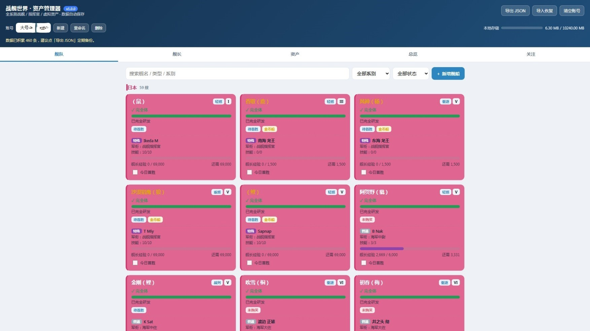
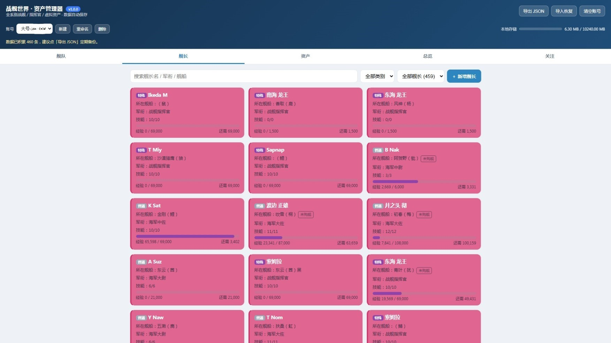
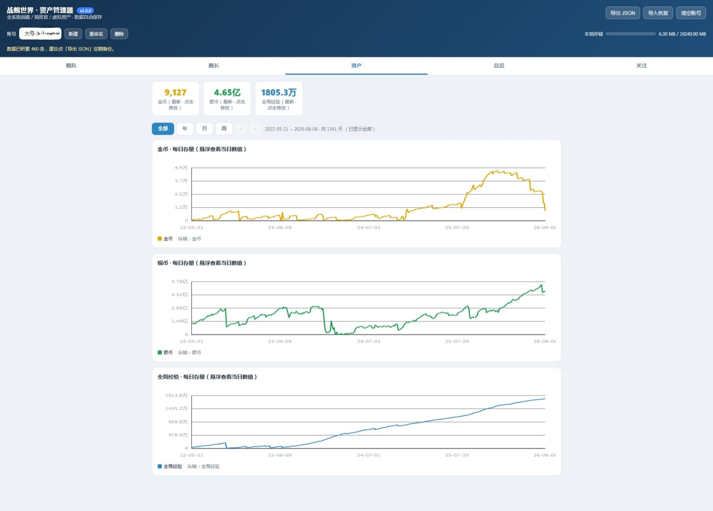
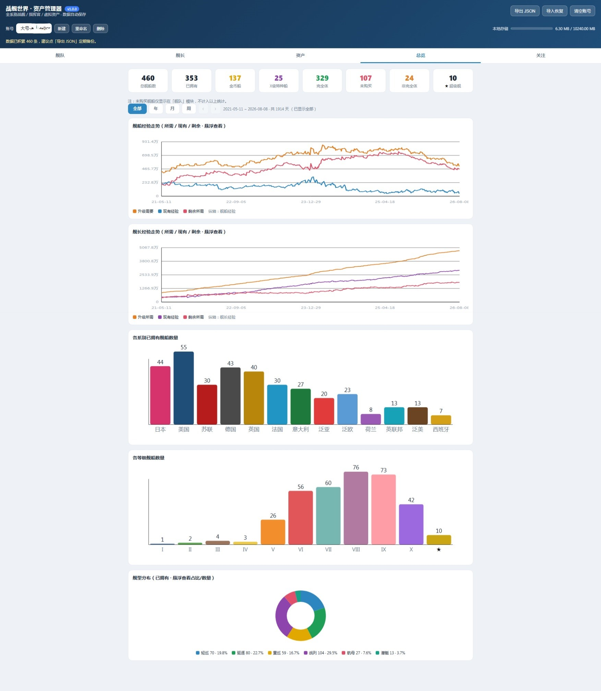
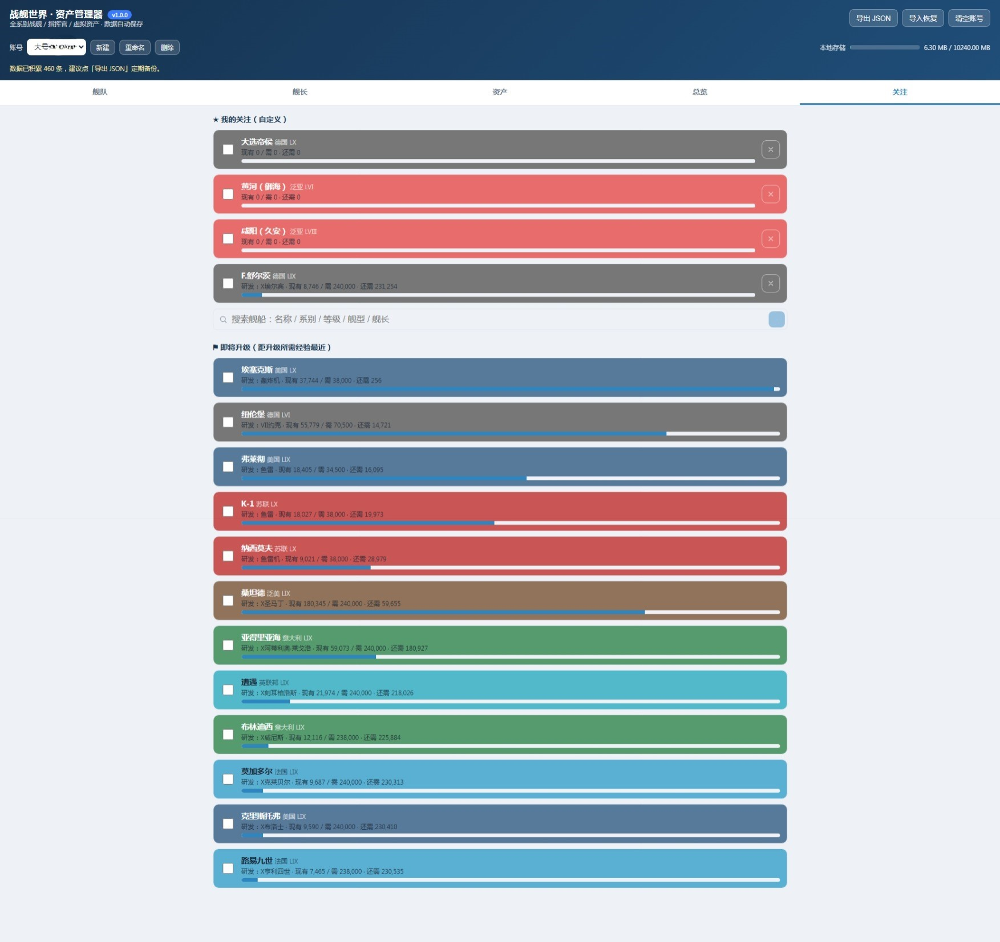

# 战舰世界 · 资产管理器（WOWs Asset Manager）

一个**零依赖、纯前端**的《战舰世界》个人资产管理与进度追踪工具，帮助你把舰船、舰长、虚拟资产、每日经验等数据集中管理、可视化走势、随时复盘。

> 软件版本：**v1.0.0**

---

## ⚠️ 重要说明（务必先读）

1. **仅支持《战舰世界》国服（中国大陆服务器）**
   本工具的舰船/舰长数据、系别、等级、经验体系均按**国服**口径内置，暂不支持国际服 / 亚服等其他服务器。

2. **数据需手动录入，不能自动抓取**
   本工具**不具备**从《战舰世界》国服客户端或官网自动读取数据的能力。所有舰船、舰长、资产、经验等信息都需要你**手动输入 / 编辑**。请勿期待「一键同步游戏数据」。

3. **数据保存在本地**
   数据不会上传到任何第三方服务器（见下方「数据存储」说明）。这也意味着换设备 / 清浏览器后数据不会自动跟随，重要数据请定期导出备份。

---

## 功能特性

软件主界面分为 **5 个板块**（底部导航切换，移动端为底部 Tab）：

| 板块 | 说明 | 对应截图 |
| --- | --- | --- |
| **舰队** | 舰船总览与管理 | `img/01.舰队管理.jpg` |
| **舰长** | 舰长总览与管理 | `img/02.舰长管理.jpg` |
| **资产** | 虚拟资产存量走势 | `img/03.虚拟资产存量走势.jpg` |
| **总览** | 经验存量走势 + 舰船分类图表 | `img/04.经验存量走势和舰船分类图表.jpg` |
| **关注** | 每日出战舰船关注 | `img/05.每日出战舰船关注.jpg` |

### 舰队
- 按**系别**（日 / 美 / 苏 / 德 / 英 / 法 / 意 / 泛亚 …）分组展示舰船卡片
- **实时搜索**：输入舰名 / 类型 / 系别即时过滤（支持中文输入法）
- **筛选**：系别、状态（非完全体 / 完全体 / 未购买 / 金币船 / X 级特种船）
- **今日首胜**标记：勾选当日首胜，次日自动顺延
- **拖拽排序**：仅允许同系别、同级别之间调整顺序（与游戏服务器一致）
- 新增 / 编辑舰船：支持「无舰长」、可在普通船与金币·特种船之间切换
- 研发模块 / 完全体进度追踪

### 舰长
- 舰长卡片列表，支持**实时搜索**（按名字 / 兵种 / 所在舰船名）
- 按兵种、是否配属筛选
- 字段：**剩余技能点**、**技能点总数/级别**、**升级到下一级所需经验**、配属舰船
- 新增 / 编辑 / **删除**舰长（删除已配属舰长时会自动解除该舰船的配属关系）

### 资产
- **虚拟资产存量走势图**：记录并可视化各类虚拟资产（达布隆、全局经验、招募点等）的存量变化
- 区间切换：**全部 / 年 / 月 / 周**
- 图表支持**横向拖拽**查看历史区间

### 总览
- **经验存量走势图**：可视化账号经验存量随时间变化
- **舰船分类图表**：按系别 / 级别分布的统计图表
- 鼠标悬停查看具体数值
- 同样支持区间切换（全部 / 年 / 月 / 周）与横向拖拽

### 关注
- **每日出战舰船关注**：集中查看今天计划 / 需要关注的舰船与进度
- 与「舰队」板块的首胜标记联动

---

## 两种运行方式

同一个 `public/index.html` 文件，根据运行环境自动适配两种模式，**你无需维护两份代码**：

### 方式 A：Node 动态版（推荐在桌面 / 服务器长期使用）
数据保存在**服务器端**（`save/` 目录，按账号分文件）。

```bash
# 1. 安装依赖（本项目零运行时依赖，仅需 Node ≥ 18）
# 2. 启动
node server.js
# 或
npm start

# 3. 浏览器打开
#    http://localhost:8787
```

- 首次启动会自动创建默认账号「大号-龙没耳」
- 顶部账号行可**新建 / 重命名 / 删除**账号
- 启动后也可用 `run.bat`（Windows）一键运行并打开 Edge 浏览器

> 部署到支持 Node 的托管（如 Railway / Render）时，使用仓库内的 `Dockerfile` / `Procfile` 即可：`web: node server.js`，端口读取环境变量（默认 8787）。

### 方式 B：静态单文件版（丢到任意静态托管 / 直接打开）
数据保存在**浏览器 `localStorage`**（经 LZW 压缩，约 2.4× 压缩比，显著缓解 5MB 配额压力）。

- 直接把 `public/index.html` 上传到 GitHub Pages / 对象存储 / 任意静态托管
- 或用浏览器**直接打开**本地 `public/index.html`（`file://` 亦可，会自动降级为内存存储兜底）
- 无服务器时自动进入「本地」模式，账号数据存于本机浏览器

### 两种模式对比

| 项目 | Node 动态版 | 静态单文件版 |
| --- | --- | --- |
| 数据存储位置 | 服务器 `save/` | 浏览器 `localStorage`（压缩） |
| 多设备共享 | ✅（同账号随处访问） | ❌（仅本机本浏览器） |
| 是否需要服务器 | 需要 Node | 不需要 |
| 账号行用量显示 | 「数据 x.xx MB」 | 「本地存储 x.xx / 5.00 MB」进度条 |
| 部署难度 | 中（需 Node 环境） | 低（纯静态） |

---

## 数据存储与备份

- **Node 版**：每个账号一个 JSON 文件，存于服务器 `save/`，服务器重启不丢。
- **静态版**：数据经 LZW + Base64 压缩后写入 `localStorage`，带 `LZ1:` 前缀；旧明文数据兼容回退。
- **导出 / 导入**：两种模式均支持**导出 JSON 备份**与**导入恢复**，可用于迁移或防止误删。
- **用量提示**：账号行末尾显示存储占用进度条；接近上限（≥70% 变橙、≥90% 变红）时建议导出备份。

> 隐私提示：无论哪种模式，数据都只存在于你自己的服务器 / 浏览器，**不会上传到任何第三方**。

---

## 截图预览

> 以下截图均为国服数据（示例账号），手动录入后的界面效果。

### 1. 舰队管理
按系别分组的舰船卡片，支持搜索、筛选、今日首胜标记与拖拽排序。



### 2. 舰长管理
舰长卡片列表，支持搜索、技能点 / 经验字段展示与配属管理。



### 3. 虚拟资产存量走势
各类虚拟资产存量随时间变化的可视化走势图，支持全部 / 年 / 月 / 周区间切换。



### 4. 经验存量走势和舰船分类图表
经验存量走势 + 按系别 / 级别分布的舰船分类统计图表，悬停查看数值。



### 5. 每日出战舰船关注
集中关注每日出战舰船与进度，与舰队首胜标记联动。



---

## 技术栈

- **零运行时依赖**：纯 HTML + 原生 JavaScript + 内联 CSS，单文件即可运行
- **零外部框架 / CDN**：图表为手写内联 SVG，图标为内联 SVG path，离线可用
- **服务端**（动态版）：零依赖 Node.js（`server.js`，仅用内置模块）
- 压缩：浏览器内置 `TextEncoder` / `TextDecoder` / `btoa` / `atob` + 自研 LZW

---

## 项目结构

```
wows-app/
├── public/
│   └── index.html        # 单文件前端（同时作为静态版入口）
├── server.js             # 零依赖 Node 服务端（动态版存储）
├── run.bat               # Windows 一键启动 + 打开 Edge
├── package.json
├── Dockerfile            # 容器化部署
├── Procfile              # PaaS 部署（Railway / Render 等）
├── .dockerignore
├── .gitattributes        # 强制 LF 换行
├── .gitignore
└── img/                  # 文档截图
```

> 注意：`save/`（账号存档）与 `_backups/`（手动备份）含真实账号数据，**不纳入版本管理**，请勿提交到公开仓库。

---

## 已知限制 / 后续计划

- [x] 国服数据口径
- [x] 手动录入 + 本地存储
- [ ] 从《战舰世界》国服自动获取数据（暂不支持，需官方 API / 手动导出，目前仅手动输入）
- [ ] 国际服 / 亚服等其他服务器支持
- [ ] 多账号云同步（当前 Node 版账号仅在部署实例内共享）

---

## 许可证

本项目采用 **[MIT License](LICENSE)**（详见仓库根目录 `LICENSE` 文件）。

- 你可以**自由使用、修改、分发**本软件。
- 但本软件**不提供任何担保**，按「AS IS」提供，使用风险由使用者自行承担；作者不对因使用本软件导致的任何损失或纠纷负责。
- 分发本软件时，**必须保留原始版权声明与许可声明**。

> 免责声明：《战舰世界》及其相关名称、素材的知识产权归 Wargaming 所有。本项目为独立的个人非官方工具，与 Wargaming 无任何隶属、授权或背书关系，亦不从其获取数据或资源。
